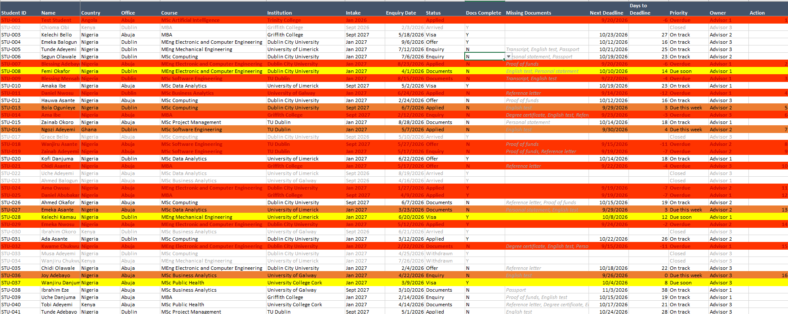
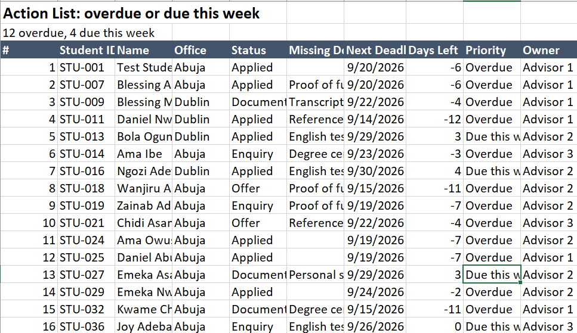
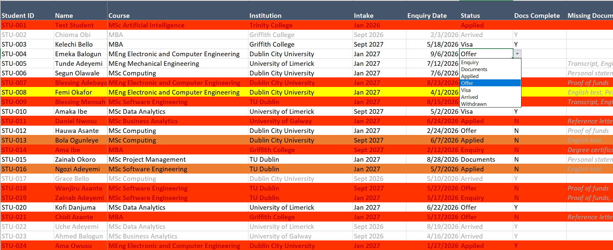

# student-application-tracker
> **Prototype Excel tracker for study-abroad applications.** built with fictional data: validated entry, automated deadline priority, conditional flags and a self updating action list
> A prototype Excel workbook for tracking international student applications from first enquiry to arrival, designed around the typical workflow of a small study-abroad consultancy with two offices.

> 

> ## Problem
> Study-abroad consultancies often track applications manually, so missing documents and approaching deadlines get noticed late. This prototype puts every student's status in one place and generates a daily list of who needs chasing.

## Features
- **Validated data entry**: dropdowns for status, office, intake, advisor and document completeness, plus date checks, so entries stay consistent and calculations stay reliable.
- **Automatic deadline tracking**: calculates days remaining with `TODAY()` and assigns a priority: Overdue, Due this week, Due soon, On track or Closed.
- **Visual flags**: conditional formatting colours each row by priority and highlights missing documents.
- **Self-updating Action List**: a running-count helper column plus `INDEX/MATCH` pulls every overdue or urgent student onto one sheet.

## Workbook Structure
| Sheet | Purpose |
|---|---|
| README | Prototype notice |
| APPLICANTS | One row per student; users edit columns A–L and O |
| LISTS | Dropdown options, edited in one place to update every dropdown |
| ACTION LIST | Auto-generated chase list; no manual editing |

## Key formulas
- Days to deadline: `=IF(OR(L2="",I2="Arrived",I2="Withdrawn"),"",L2-TODAY())`
- Priority: nested `IF` checks ordered from most to least urgent
- Action list lookup: `=IFERROR(INDEX(APPLICANTS!B:B,MATCH($A4,APPLICANTS!$P:$P,0))&"","")`

## Skills demonstrated
Data validation · nested IF logic · relative, absolute and mixed cell references · conditional formatting · INDEX/MATCH lookups · running counts · data anonymisation · spreadsheet design for non-technical users

## Planned next steps
- Reporting dashboard with pivot tables and charts (enquiries per month, conversion funnel, intake trends)
- Automated deadline reminder emails
